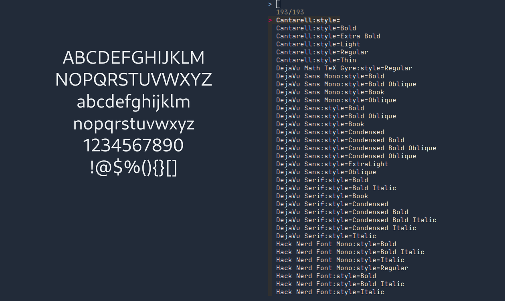

`fontpreview-ueberzug` is a POSIX shell script to preview all fonts installed on system in `fzf` with `ueberzug`. It is inspired by [fontpreview](https://github.com/sdushantha/fontpreview) project while most of the code are completely rewritten here.



## Dependencies

- [`fzf`](https://github.com/junegunn/fz://github.com/junegunn/fzf)
- [`ueberzug`](https://github.com/seebye/ueberzug)
- `imagemagick`
- `fontconfig`

## Usage

```
Usage: fontpreview [-h] [-s FONT_SIZE] [-b BG_COLOR] [-f FG_COLOR] [-t PREVIEW_TEXT]

Options:
   -h show this help message and exit
   -s font size ($FONT_SIZE)
   -b background color ($BG_COLOR)
   -f foreground color ($FG_COLOR)
   -t preview text
```

## Configure

This script makes use of some of the environment variables as follows, these are the same in [fontpreview](https://github.com/sdushantha/fontpreview) so you can use the same settings with `fontpreview-ueberzug`:

- `FONTPREVIEW_FONT_SIZE`: Font size
- `FONTPREVIEW_BG_COLOR`: Background color
- `FONTPREVIEW_FG_COLOR`: Foreground color
- `FONTPREVIEW_PREVIEW_TEXT`: Preview text to display

## Difference from [fontpreview](https://github.com/sdushantha/fontpreview)

- Does not need two windows (terminal and sxiv) to display. Use `ueberzug` instead.
- Preview updates as you scroll without having to press enter also going back to the first font in list.
